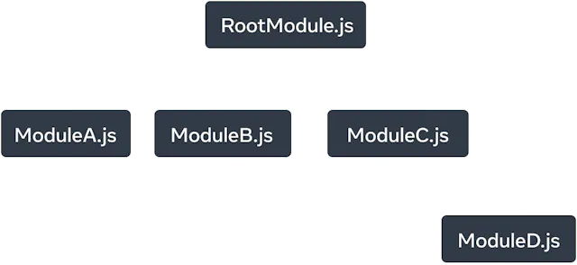

# MD Example
This is a markdown file. It is a simple way to format text. You can use it to create headers, lists, links, and more. Here is an example of a list:

- Item 1
- Item 2
- Item 3
 [dependency tree](README.md)