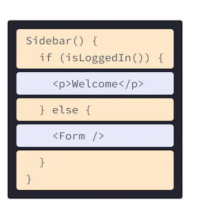

# Get Started
## Installation
To install the package, run the following command:
```bash
pip install my_package
```
## Usage
To use the package, run the following command:
```bash
python -m my_package
```
## Example
Here is an example of how to use the package:
```python
import my_package
my_package.my_function()
```

[Get Started](get_started.md) 